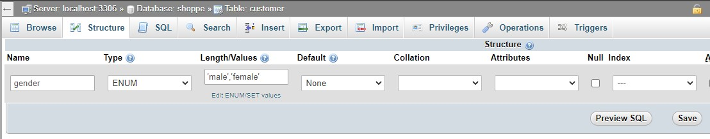
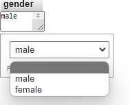
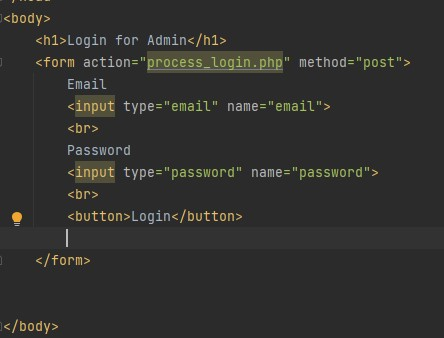
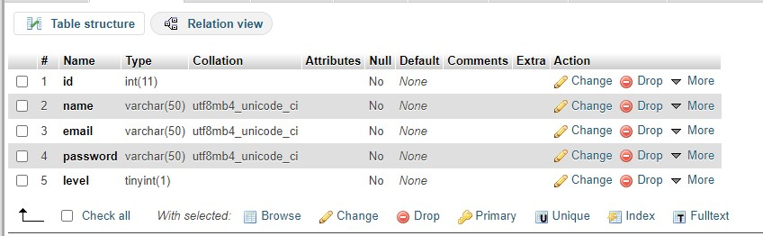
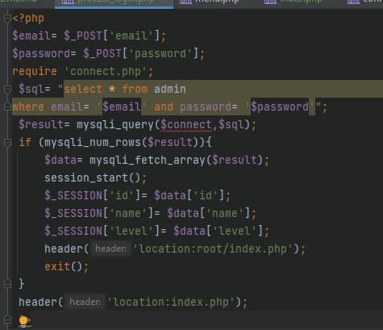
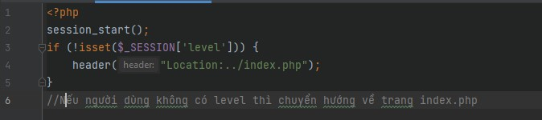
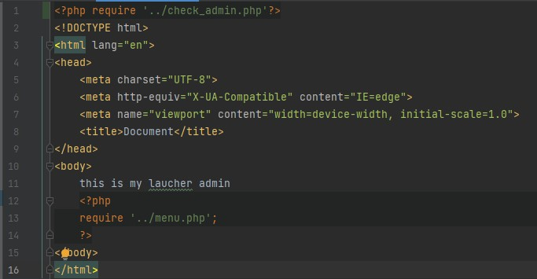

# 23/5/2022 

## Enum

Enum là một tập hợp các giá trị có thể có của 1 thuộc tính, chẳng hạn Giới tính thì có thể Nam, Nữ (nay thì có thêm Gay, Less), hay tình trạng hôn nhân Status của 1 người thì có thể là Single, Engaged, Complicated, Married. Kiểu dữ liệu mặc định của Enum là int, phần tử đầu tiên có giá trị là 0 và các phần tử tiếp theo có giá trị mặc định tăng lên 1.

Xem thêm nhiều tài liệu tham khảo [Tại đây](https://viblo.asia/p/java-enum-Az45bN2w5xY)

Ví dụ: Thêm trường giới tính vào bảng customer



> Trong đó, Type: Enum, Length/Values: 'giá trị 1', 'giá trị 2'.

Khi đó, trường gender sẽ có kiểu như sau:



## Tính năng login dành cho admin

Tạo file index.php trong folder dành cho admin như sau:
```
newcode/admin/...
.
└── index.php  <-- file mới
```

Setup file .../newcode/admin/index.php như sau:




Tạo db dành cho admin:(database name: admin)
> id: id dành cho quản lý (Int)
> 
> name: tên quản lý (Varchar)
> 
> email: ...(Varchar)
> 
> password: ...(Varchar)
> 
> level: cấp độ (Boolean)

Kết quả:

Tiến hành INSERT dữ liệu vào db admin(Mình lười nên các bạn tự tạo trang đăng ký nhé)

Tạo file process_login.php cho tiến trình đăng nhập theo cây thư mục sau:
```
newcode/admin/...
.
├── ...
├── index.php
└── process_login.php  <-- file mới
```

Nội dung file process_login.php:



Tính năng đăng nhập vẫn như mọi lần nhưng ở đây phải chú ý đến phần lưu lại session level với mục đích phân role.
Trước khi phân role thì check admin bằng cách tạo file check_admin.php trong folder admin:

```
newcode/admin/...
.
├── ...
├── index.php
├── check_admin.php  <-- file mới
└── process_login.php
```

Nội dung file check_admin.php:


Để kích hoạt chức năng check admin bằng cách require file check_admin.php vào folder root:

```
newcode/admin/root/...
.
├── ...
└── index.php <-- file chỉnh sửa
```

Nội dung file index.php:



Khi người dùng cố tình trỏ route đến admin thì điều chuyển hướng về trang đăng nhập.


