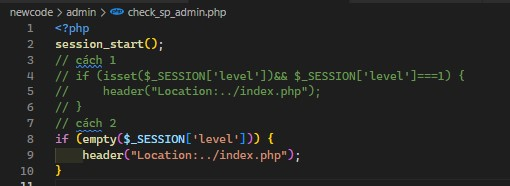

# Contine =)))


Lần lượt thêm ``<?php require '../check_admin.php'?>`` vào đầu file dành cho admin

Đối với SP admin thì lại là một câu chuyện khác.

Ta tiến hành tạo file check sp admin trong folder admin:

```
newcode/admin/...
.
├── ...
├── index.php
├── check_sp_admin.php  <-- file mới
├── check_admin.php
└── process_login.php
```

Nội dung file check_sp_admin.php:



Sau đó tiến hành ```require '../check_sp_admin.php'``` vào folder dành cho sp admin

Setup thêm tính năng check order trong folder admin/r3:


